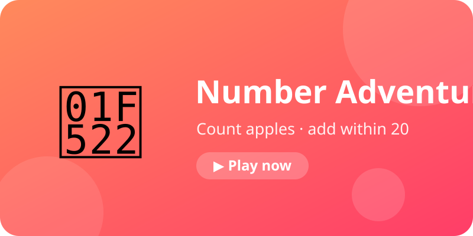
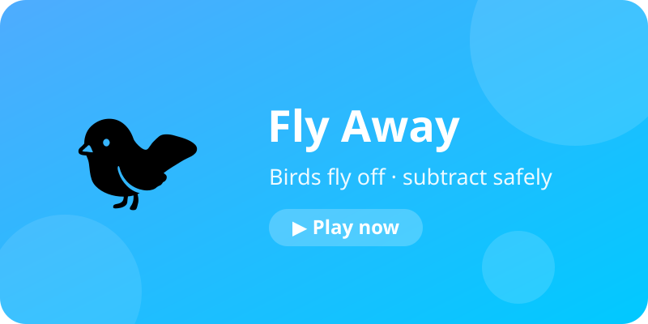
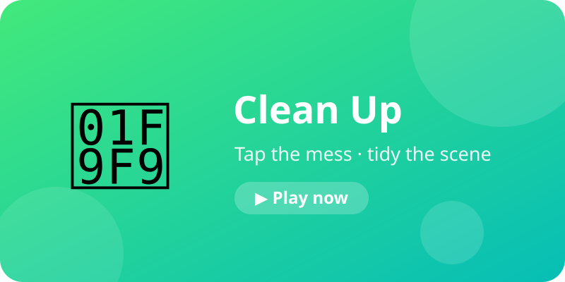
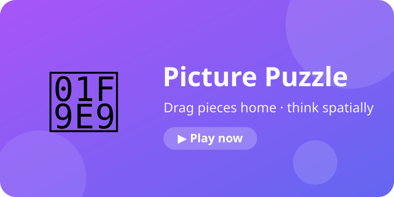
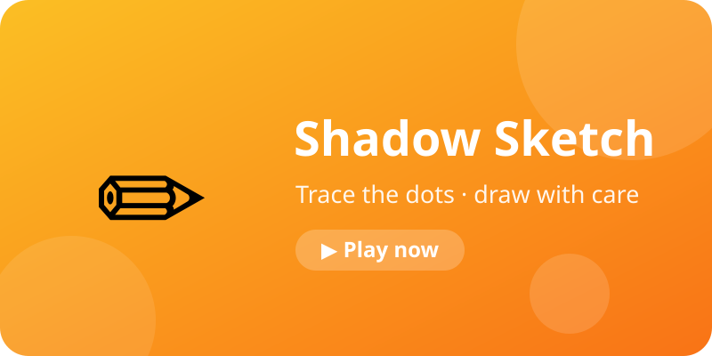
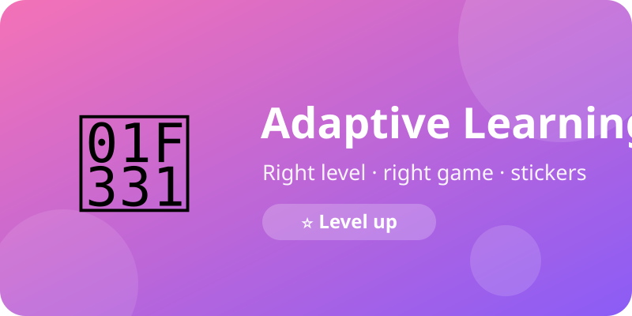
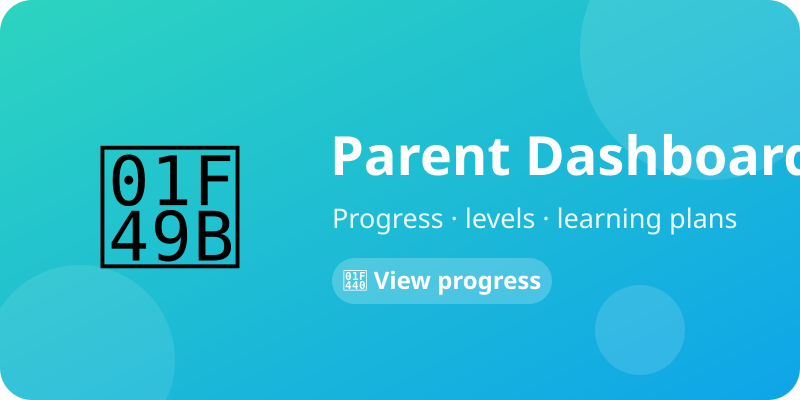
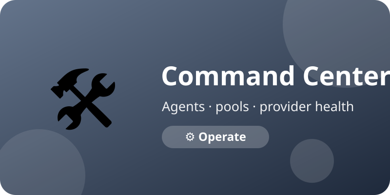

# Learnzzy — Play. Think. Learn.

A deterministic, fast, and safe educational kids playground (PWA) with an
asynchronous AI/agent workforce operating behind the scenes.

> Child experience: deterministic, fast, simple, safe, delightful.
> Intelligence (AI, personalization, educational knowledge, agents) stays
> server-side and never blocks gameplay.

## Features

| | | |
|---|---|---|
|  |  |  |
|  |  |  |
|  |  | |

1. **Number Adventure** — addition through pictures
2. **Fly Away** — subtraction by counting what remains
3. **Clean Up** — spot-and-clean scenes
4. **Picture Puzzle** — drag/tap spatial puzzles
 5. **Shadow Sketch** — tracing with forgiving evaluation
 6. **Learning World** — 6 categories (numbers/words/think/create/discover/
    puzzles) → 16 activities; 10 run on a deterministic generic engine
    (age-adaptive complexity, teaching hints), shipped games linked
 7. **Adaptive Learning** — levels, plans, stars, stickers
 8. **Parent Dashboard** — progress, insights, pairing
 9. **Command Center** — agents, pools, provider health (admin)

## Stack

Next.js 14 + TypeScript + Phaser 3 + Tailwind CSS · MongoDB · Redis + BullMQ ·
Zod · GPT-5 nano/mini behind an AI abstraction · Docker + Nginx · Playwright

## Quick start (Windows)

Double-click `run.bat` (menu), or:

```bat
run.bat dev      :: dev server → http://localhost:3000
run.bat prod     :: production build + start
run.bat docker   :: full stack (web + worker + mongo + redis)
run.bat seed     :: seed MongoDB content pools
```

MongoDB/Redis run in Docker (`mongodb://mongo:27017`, `redis://redis:6379`
inside containers; host dev uses mapped `127.0.0.1` ports — see `.env.example`).

## Key routes

- `/` landing · `/welcome` learner setup · `/play` game home · `/learn/[category]` learning categories · `/learn/[category]/[activity]` activities · `/play/*` games
- `/stickers` collection · `/link` parent-device pairing
- `/parents/*` public parent info · `/parent/*` parent dashboard (auth)
- `/admin` command center (auth) · `/api/health`, `/health`

## Architecture highlights

- **Deterministic game engine** — math recomputed and re-validated; browser
  is never authoritative for score, rewards, or progression.
- **Validated content pools** — only `active` content is playable; low pools
  refill asynchronously via agents.
- **Adaptive learning** — anonymous learner profiles (nickname + age band),
  15 level configs, server-side promotion (3+ completions at 80%+, max +1
  level), stars/stickers, validated learning plans.
- **Education Gateway** (`src/integrations/education/`) — allowlisted
  Tutor/OER/NCERT providers, all disabled by default with deterministic
  mocks; advisory-only (plans never reordered, levels/scores untouched).
- **Academic Engine** (`src/services/academicEngine.ts` + `src/lib/academic.ts`) — answers "what next?" as a Validated Learning Plan (LEARN→MASTER stages, review-first, no-jump decisions, `validateAcademicPlan` gate); MCP failures never stop gameplay.
- **Voice Engine** (`src/lib/voice.ts`) — Teddy/Bunny/Owl/Monkey/Parrot × 11 events × 5 locales (en/hi/bn/ta/te), cached in `voiceAssets`; never live TTS in gameplay.
- **Living Wonder worlds** (`src/lib/worlds.ts`, `WonderBits.tsx`) — Stitch-grounded banner cards, guide/feedback bits, and optimized scene postcards; presentation only, mechanics untouched.
- **Learning Playground** (`src/lib/categories.ts`, `complexity.ts`, `activityRegistry.ts`, `activityContent.ts`) — category-first home, deterministic worksheet-inspired generators with §27 age baseline, `GET /api/activities/[id]/content`, generic `ActivityPlayer`; results reuse game-events + academic/result (DEC-188).
- **8 agents** — content, quality/safety, asset, analytics, difficulty,
  personalization, QA, academic — least-privilege, retried, audited.
- **Parents** — separate auth, single-use expiring pairing codes, active-link
  authorization, validated summaries only.

## Verify

```bash
npm run typecheck
npm run lint
npm test          # 182 unit tests (22 academic/voice/theme, 5 worlds, 8 activity engine)
npm run test:e2e  # 52 Playwright specs (uses system Chrome)
npm run build
```

## Docs

`docs/` is the source of truth: `PROJECT.md`, `ARCHITECTURE.md`,
`BUSINESS_RULES.md`, `DATABASE.md`, `API.md`, `DECISIONS.md`,
`MCP_INTEGRATION.md`, `STITCH_INSTRUCTIONS.md`, `NEXT_SESSION.md`.
Stitch designs are the visual reference; docs govern architecture.

## Environment

Copy `.env.example` to `.env.local`. Secrets stay server-side
(`never NEXT_PUBLIC_*`). Generate admin credentials with:

```bash
node scripts/admin-setup.mjs <password-min-12-chars>
```
